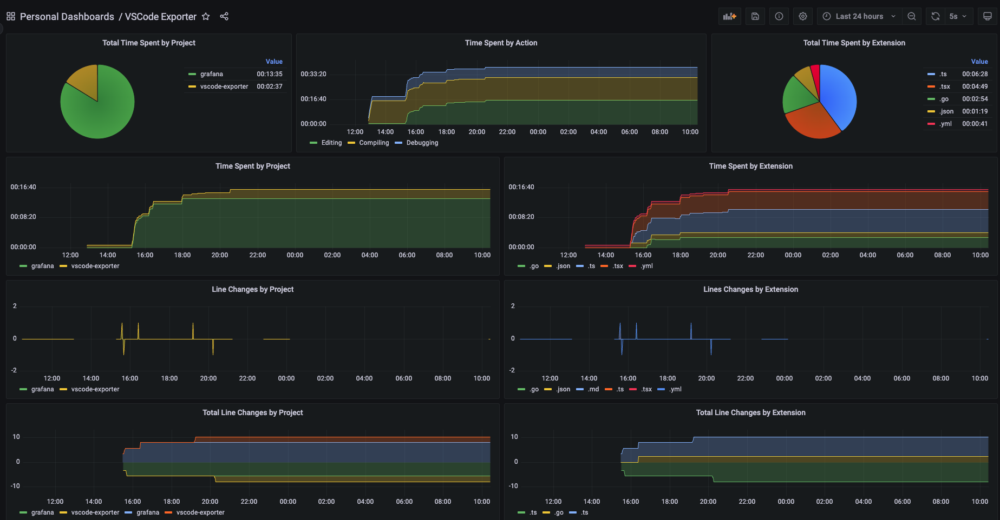

### Hi there 👋

<!--
**guicaulada/guicaulada** is a ✨ _special_ ✨ repository because its `README.md` (this file) appears on your GitHub profile.

Here are some ideas to get you started:

- 🔭 I’m currently working on ...
- 🌱 I’m currently learning ...
- 👯 I’m looking to collaborate on ...
- 🤔 I’m looking for help with ...
- 💬 Ask me about ...
- 📫 How to reach me: ...
- 😄 Pronouns: ...
- ⚡ Fun fact: ...
-->

You can check what I've been working on live on my public dashboard:
[](https://guicaulada.grafana.net/public-dashboards/e00f2ad838544b02826e8c075c05df45?orgId=1&refresh=30s)

<!--START_SECTION:waka-->


**🐱 My Github Data** 

> 🏆 454 Contributions in the Year 2022
 > 
> 📦 1.2 MB Used in Github's Storage 
 > 
> 🚫 Not Opted to Hire
 > 
> 📜 74 Public Repositories 
 > 
> 🔑 38 Private Repositories  
 > 
**I'm an Early 🐤** 

```text
🌞 Morning    136 commits    █████░░░░░░░░░░░░░░░░░░░░   21.25% 
🌆 Daytime    239 commits    █████████░░░░░░░░░░░░░░░░   37.34% 
🌃 Evening    201 commits    ███████░░░░░░░░░░░░░░░░░░   31.41% 
🌙 Night      64 commits     ██░░░░░░░░░░░░░░░░░░░░░░░   10.0%

```
📅 **I'm Most Productive on Wednesday** 

```text
Monday       158 commits    ██████░░░░░░░░░░░░░░░░░░░   24.69% 
Tuesday      101 commits    ████░░░░░░░░░░░░░░░░░░░░░   15.78% 
Wednesday    175 commits    ██████░░░░░░░░░░░░░░░░░░░   27.34% 
Thursday     80 commits     ███░░░░░░░░░░░░░░░░░░░░░░   12.5% 
Friday       67 commits     ██░░░░░░░░░░░░░░░░░░░░░░░   10.47% 
Saturday     28 commits     █░░░░░░░░░░░░░░░░░░░░░░░░   4.38% 
Sunday       31 commits     █░░░░░░░░░░░░░░░░░░░░░░░░   4.84%

```


📊 **This Week I Spent My Time On** 

```text
⌚︎ Time Zone: America/Sao_Paulo

💬 Programming Languages: 
No Activity Tracked This Week

🔥 Editors: 
No Activity Tracked This Week

🐱‍💻 Projects: 
No Activity Tracked This Week

💻 Operating System: 
No Activity Tracked This Week

```

**I Mostly Code in JavaScript** 

```text
JavaScript               23 repos            ██████░░░░░░░░░░░░░░░░░░░   27.38% 
TypeScript               18 repos            █████░░░░░░░░░░░░░░░░░░░░   21.43% 
Java                     7 repos             ██░░░░░░░░░░░░░░░░░░░░░░░   8.33% 
Lua                      7 repos             ██░░░░░░░░░░░░░░░░░░░░░░░   8.33% 
C#                       6 repos             █░░░░░░░░░░░░░░░░░░░░░░░░   7.14%

```


 Last Updated on 12/12/2022
<!--END_SECTION:waka-->
