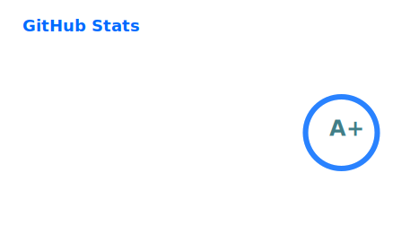
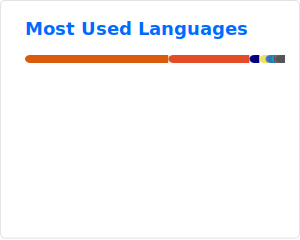

# Hello, I'm Gui! 👋

I'm a software engineer who thrives on building reliable systems at scale. My day-to-day revolves around cloud infrastructure, platform engineering, and finding elegant solutions to gnarly distributed systems problems. I enjoy the full spectrum — from writing Go services to wiring up Terraform and Kubernetes, to crafting developer tools that make teams more productive.

I'm endlessly curious and always picking up something new. Lately that means diving deep into AI-augmented engineering workflows and agentic systems, exploring how LLMs can reshape the way we build software.

### 🎯 Current Focus

- Cloud infrastructure & BYOC at scale
- AI-augmented engineering workflows
- Agentic engineering & prompt engineering

### 🛠️ Languages and Tools

  
   
  
   
  

### 📊 Stats

Explore my live coding activities on my [Public Grafana Dashboard](https://guicaulada.grafana.net/public-dashboards/7b7f644500ec4e6cb5d7a4e7b5ed0dab), built with [vscode-exporter](https://github.com/guicaulada/vscode-exporter).

### 💬 Let's Chat on Discord

For questions about programming or any of my projects, feel free to contact me on Discord: `sighmir`.
