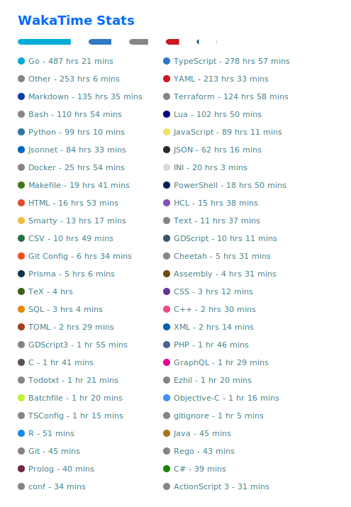

# Hey, I'm Gui 👋

Software engineer working on cloud infrastructure and platform engineering. I spend most of my time writing Go services, setting up Terraform and Kubernetes, and building internal tools. Distributed systems problems are my favorite kind.

Lately I've been getting into AI-augmented development, mostly agentic systems and figuring out where LLMs actually help in day-to-day engineering work.

### What I'm working on

- Cloud infrastructure & BYOC at scale
- AI-augmented engineering workflows
- Agentic engineering & prompt engineering

### Languages and tools

  
   
  
   
  
   
  

### Stats

I also have a [public Grafana dashboard](https://guicaulada.grafana.net/public-dashboards/7b7f644500ec4e6cb5d7a4e7b5ed0dab) tracking my coding activity, built with [vscode-exporter](https://github.com/guicaulada/vscode-exporter).

### Discord

Questions about my projects or programming in general? Find me on Discord: `sighmir`.
